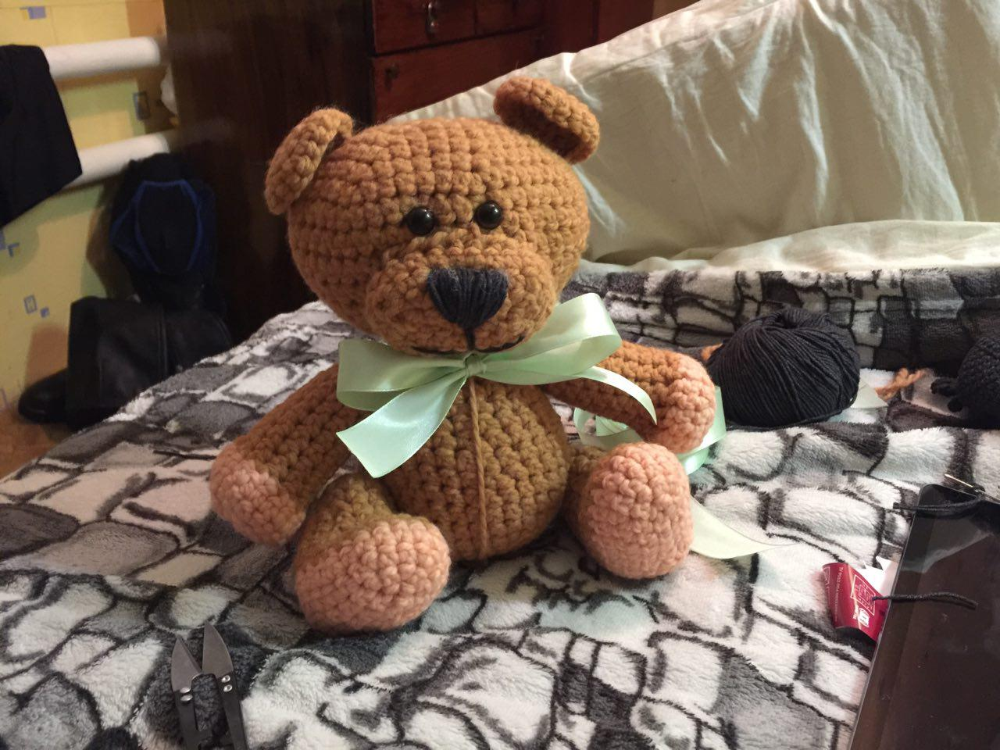

### Коричневый мишка

В мире творческих людей всегда находятся очень интересные идеи, встретив которые непременно хочется сотворить подобное. Таким я нашла мастер-класс Лили Искаковой. 
-Хочу такого,-сказала я в тот вечер, когда случайно нашла мишку-погремушку в просторах интернета. 
С большим вдохновением и желанием скорее начать, мы выехали за необходимым материалом. Процесс творения превращается в волшебство. Не хочется прекращать и останавливаться. Уже через некоторое время мой мишка был готов. Признаюсь честно, не была им очень довольна. Использование не тех ниток, другие размеры (мишка получился довольно большим и крупной вязки). Но, вы знаете,он стал своеобразным, неуклюже милым. Его хотелось всегда держать в руках, прижимать к себе. 
Однако,самым приятным результатом стал не процесс изготовления мишки, а реакция маленькой девочки, ставшей новой хозяйкой "коричневого мишки". Как она его гладила маленькими ручонками, какими блестящими глазками смотрела на него, когда мама спрашивала,хочет ли она этого мишку; как она радовалась и  уже не расставалась с новым другом. В тот момент я поняла: " Вот он , главный результат  - радость и тепло людям, которое можно донести своими творениями. Безусловно будем вязать дальше, с новыми идеями и большой любовью, делая мир еще чуточку добрее и счастливее.

